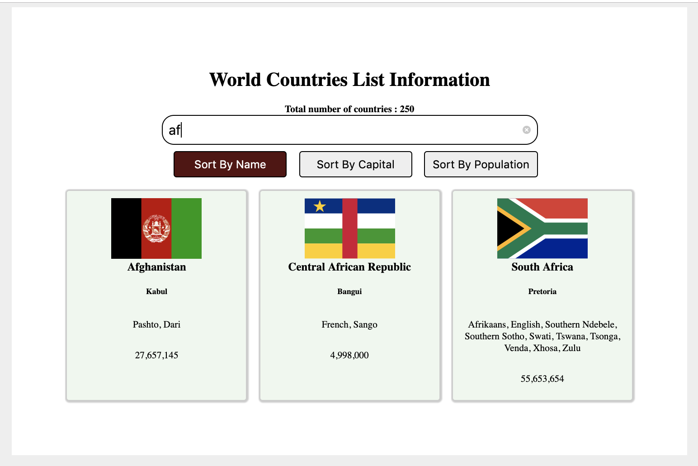

# World Countries Info

> This is the fourth mini project of javascript tutorial in Integrify!

##Demo

[countries Info sorting and search App](https://mostafain.github.io/countriesInfo_miniProject/countriesInfoIndex.html)

## Screenshot

## Technologies

- HTML
- CSS
- JavaScript

## Status

Project is: ongoing_,

## Contact

Created by [mostafa](https://github.mostafaIn.com) 

feel free to contact me!
[Email:](mostafa.hazareh@integrify.io)
